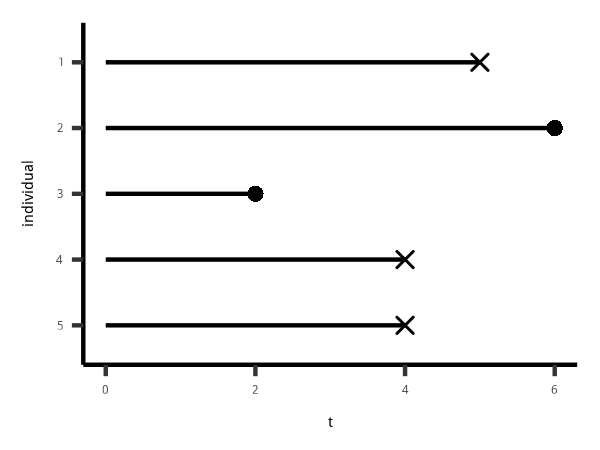

```{r fig.cap='Kaplan-Meier 参数估计'}

knitr::include_graphics('figure/timeto_survivor.png')
```

```{r message=FALSE, warning=FALSE}
library(tidyverse)
data <- 
data_frame(
    time = c(5, 6, 2, 4, 4) 
    ,event = c(1, 0, 0, 1, 1)
)

data_frame(
    day = 0:max(data$time)
) %>% 
    mutate(
        n_risk = map_int(day,~sum(. <= data$time))
    ) %>% 
    left_join(
        data %>% 
            group_by(time) %>% 
            summarise(n_event = sum(event))
        ,by = c('day'='time')
    ) %>% 
    mutate(
        n_event = ifelse(is.na(n_event),0,n_event)
    ) %>% 
    mutate(
        sur_rate = (n_risk - n_event)/n_risk
        ,sur_rate = cumprod(sur_rate)
    )
```