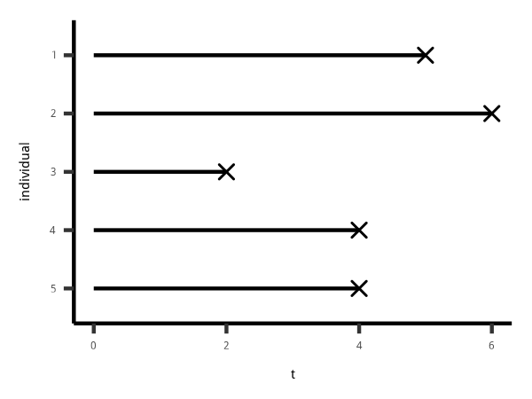
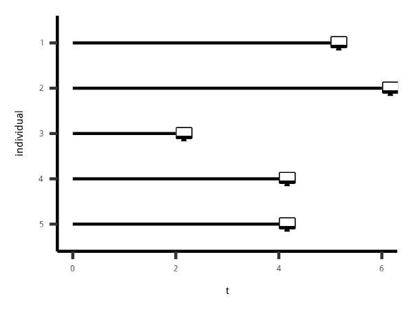
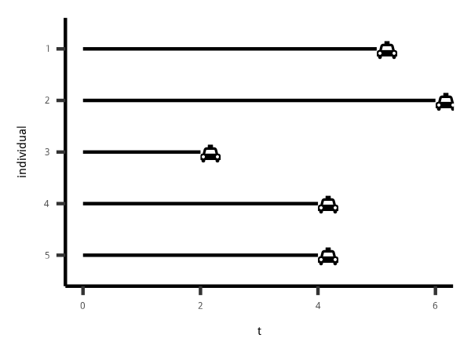
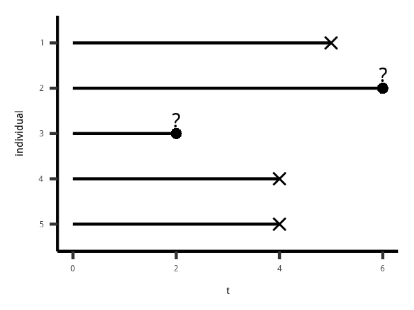
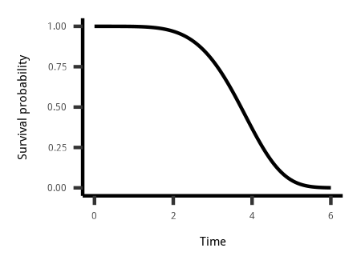
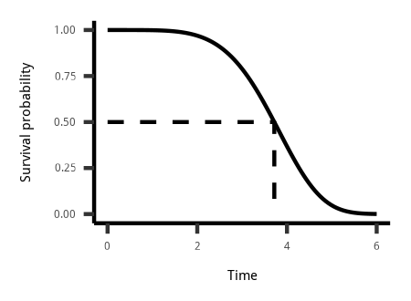
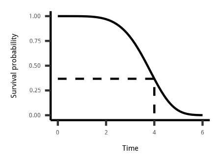

explain the importance of this topic, and provide a quick introduction to the theory behind survival curves. 

discuss why special methods are needed when dealing with time-to-event data and introduce the concept of censoring. 

We also discuss how we describe the distribution of the elapsed time until an event.

网速不行

真正关心的是
一个事件将要发生的等待时间。

以下例子说明

# 直观理解

```{r fig.cap='一个人距离死亡的时间'}

```

```{r fig.cap='一个人再次找到工作的时间'}

```

```{r fig.cap='一个人打到车的时间'}

```

# 比ols的优势

先要从数据的性质出发

1. 时间都是正数，因此不满足正态分布假设，OLS不成立
1. (right) censoring，如图 \@ref(fig:censoringplot)，id2 和 id3 实际上还死亡，因此没有产生对应的时间

```{r censoringplot,fig.cap='right censoring 举例'}

```

由于 id2 和 id3 情况特殊，因此会使用 event 标签 进行区别。

```{r eval=F}
library(survival)
library(tidyverse)
data_frame(
    time = c(5,6,3,4,4)
    ,event = c(1,0,0,1,1)
) %>% 
Surv(.$time,.$event)
```

in pipeline is wrong.
ask [RStudio Community](https://community.rstudio.com/)

```{r}
time <- c(5, 6, 2, 4, 4) 
event <- c(1, 0, 0, 1, 1)
library("survival") 
Surv(time, event)
```

这种表达方式，可以作为特征变量引入。

```{r}
data(GBSG2, package = "TH.data")
```

```{r}
library(tidyverse)
GBSG2 %>% head
```

>
This information is stored in the `censor1` variable, which has a value of `1` if an individual was re-employed at a full-time job. The `spell` variable indicates the length of time an individual was unemployed in number of two-week intervals.

```{r}
data(UnempDur, package = "Ecdat")
```

# 生存分析常回答的问题

>
1. What is the probability that a breast cancer patient survives longer than 5 years?
1. What is the typical waiting time for a cab?
1. Out of 100 unemployed people, how many do we expect to have a job again after 2 months?

```{r}

```

$$S(t) = P (T > t) = 1 - P(T < t)$$

$P(T < t)$类似于CDF，因此$S(t)$是非常直观便于理解的。
但是这里不是简单的$1 - P(T < t)$在于Kaplan-Meier曲线考虑了censor的情况
见[DataCamp](https://campus.datacamp.com/courses/survival-analysis-in-r/estimation-of-survival-curves?ex=5)

```{r fig.cap='有50%的人生存超过了3.7年'}

```


```{r fig.cap='超过4年以上生存时间的有37%'}

```
