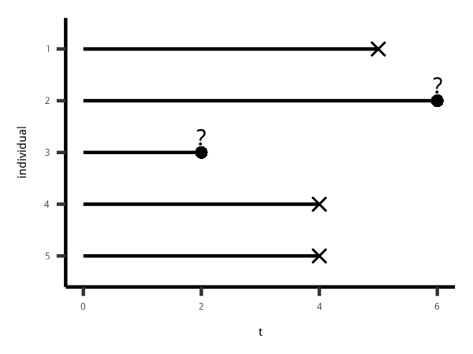

explain the importance of this topic, and provide a quick introduction
to the theory behind survival curves.

discuss why special methods are needed when dealing with time-to-event
data and introduce the concept of censoring.

We also discuss how we describe the distribution of the elapsed time
until an event.

网速不行

真正关心的是 一个事件将要发生的等待时间。

以下例子说明

# 直观理解

``` r
knitr::include_graphics('figure/timeto_0.png')
```


``` r
knitr::include_graphics('figure/timeto_fa-desktop.png')
```


``` r
knitr::include_graphics('figure/timeto_fa-taxi.png')
```


# 比ols的优势

先要从数据的性质出发

1.  时间都是正数，因此不满足正态分布假设，OLS不成立
2.  (right) censoring，如图 @ref(fig:censoring\_plot)，id2 和 id3
    实际上还死亡，因此没有产生对应的时间

<!-- end list -->

``` r

```

<!-- -->
