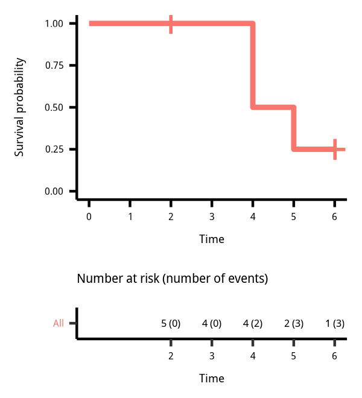

https://campus.datacamp.com/courses/survival-analysis-in-r/estimation-of-survival-curves?ex=1

Kaplan-Meier estimate
读音参考[campus](https://campus.datacamp.com/courses/survival-analysis-in-r/estimation-of-survival-curves?ex=1)

<input type="checkbox" id="checkbox1" class="styled">rep bug

```
mv ~/Downloads/*.png figure/
```

```{r fig.cap='Kaplan-Meier 参数估计'}
knitr::include_graphics('figure/timeto_1.png')

```

打点显示censoring的标签。
这样对比起来，其实很直观。

$$\hat S(t) = \prod_{i: t_t \leq t} \frac{n_i - d_i}{n_i}$$

$$\begin{alignat}{2}
\hat S(2) &= \frac{5-0}{5} = 1 \\
\hat S(3) &= \frac{4-0}{4} = 1 \\
\hat S(4) &= \frac{4-2}{4} = 0.5 \\
\hat S(5) &= 0.5 \frac{2-1}{2} = 0.25 \\
\hat S(5) &= 0.25 \frac{1-0}{1} = 0.25 \\
\end{alignat}$$

```{r}
km <- survfit(Surv(time, event) ~ 1)
ggsurvplot(km, conf.int = FALSE, risk.table = "nrisk_cumevents", legend = "none")
```

<input type="checkbox" id="checkbox1" class="styled">ggsurvplot where
