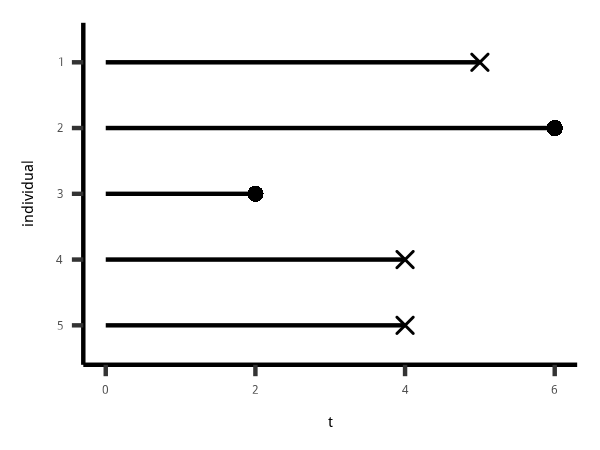
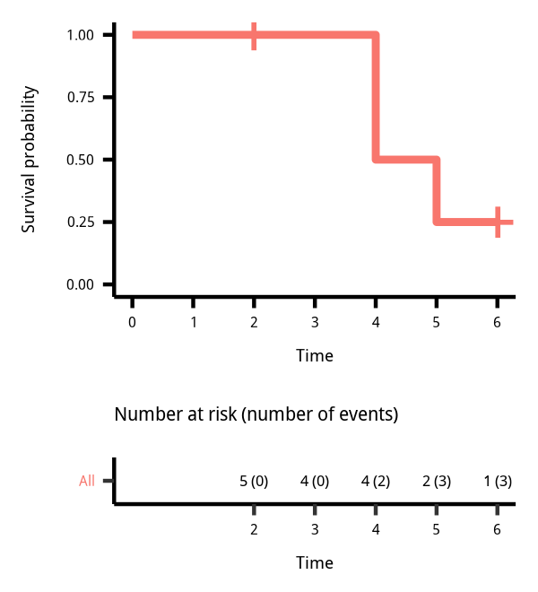
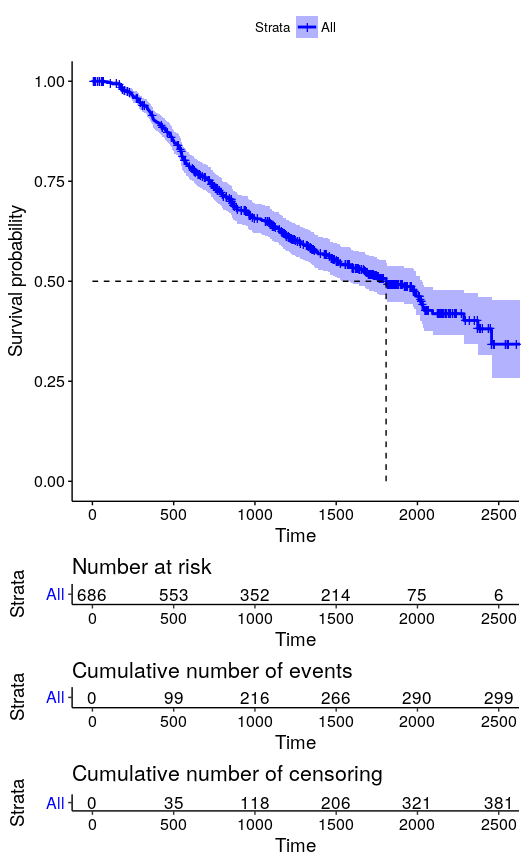
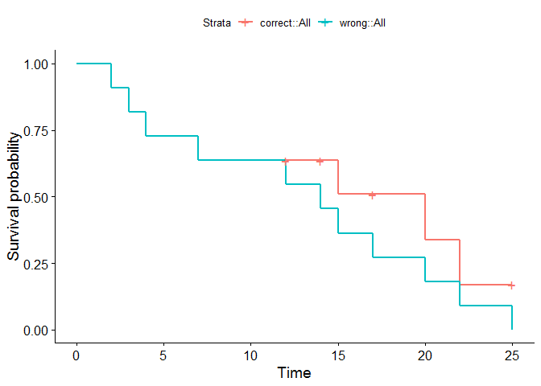
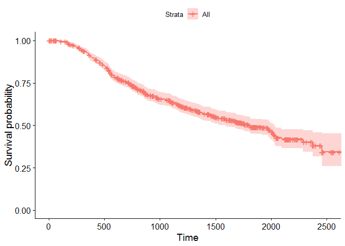
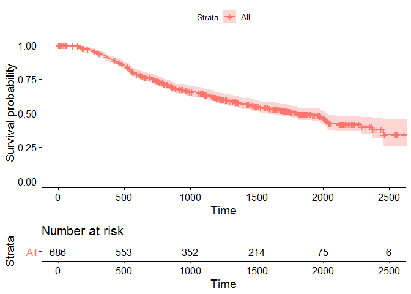
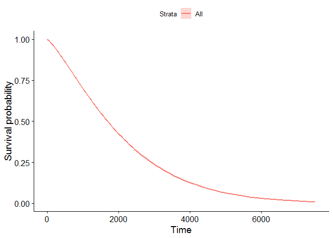

<https://campus.datacamp.com/courses/survival-analysis-in-r/estimation-of-survival-curves?ex=1>

Kaplan-Meier estimate
读音参考[campus](https://campus.datacamp.com/courses/survival-analysis-in-r/estimation-of-survival-curves?ex=1)

<details>

<summary>移动下载图片</summary>

    mv ~/Downloads/*.png figure/

</details>

``` r

```


``` r

```


打点显示censoring的标签。 这样对比起来，其实很直观。

\[\hat S(t) = \prod_{i: t_t \leq t} \frac{n_i - d_i}{n_i}\]

\[\begin{alignat}{2}
\hat S(2) &= \frac{5-0}{5} = 1 \\
\hat S(3) &= \frac{4-0}{4} = 1 \\
\hat S(4) &= \frac{4-2}{4} = 0.5 \\
\hat S(5) &= 0.5 \frac{2-1}{2} = 0.25 \\
\hat S(6) &= 0.25 \frac{1-0}{1} = 0.25 \\
\end{alignat}\]

survminer
参考[rpkgs](https://rpkgs.datanovia.com/survminer/reference/ggsurvplot.html)

``` r
time <- c(5, 6, 2, 4, 4) 
event <- c(1, 0, 0, 1, 1)
library(survival)
km <- survfit(Surv(time, event) ~ 1)
library(survminer)
```

    ## Loading required package: ggplot2

    ## Loading required package: ggpubr

    ## Loading required package: magrittr

``` r
# ggsurvplot(km, conf.int = FALSE, risk.table = "nrisk_cumevents", legend = "none")
```

Number at risk = number of event 这是很直观的表达 `legend =
"none"`是因为只有一条线，不需要legend

报错见[RStudio
Community](https://community.rstudio.com/t/questions-for-the-input-of-function-survminer-ggsurvplot/20461)

1.  `Surv()` is used to define the time-to-event outcome,
2.  `survreg()` can be used to estimate a Weibull model (see upcoming
    lessons), and with
3.  `survfit()` you can estimate survival curves, e.g. with the
    Kaplan-Meier technique.

extract relevant information from a `survfit`
    object.

``` r
library(tidyverse)
```

    ## -- Attaching packages --------------------------------------------------------------------------------- tidyverse 1.2.1 --

    ## √ tibble  1.4.2     √ purrr   0.2.5
    ## √ tidyr   0.8.2     √ dplyr   0.7.8
    ## √ readr   1.2.1     √ stringr 1.3.1
    ## √ tibble  1.4.2     √ forcats 0.3.0

    ## -- Conflicts ------------------------------------------------------------------------------------ tidyverse_conflicts() --
    ## x tidyr::extract()   masks magrittr::extract()
    ## x dplyr::filter()    masks stats::filter()
    ## x dplyr::lag()       masks stats::lag()
    ## x purrr::set_names() masks magrittr::set_names()

``` r
str(km)
```

    ## List of 13
    ##  $ n        : int 5
    ##  $ time     : num [1:4] 2 4 5 6
    ##  $ n.risk   : num [1:4] 5 4 2 1
    ##  $ n.event  : num [1:4] 0 2 1 0
    ##  $ n.censor : num [1:4] 1 0 0 1
    ##  $ surv     : num [1:4] 1 0.5 0.25 0.25
    ##  $ type     : chr "right"
    ##  $ std.err  : num [1:4] 0 0.5 0.866 0.866
    ##  $ lower    : num [1:4] 1 0.1877 0.0458 0.0458
    ##  $ upper    : num [1:4] 1 1 1 1
    ##  $ conf.type: chr "log"
    ##  $ conf.int : num 0.95
    ##  $ call     : language survfit(formula = Surv(time, event) ~ 1)
    ##  - attr(*, "class")= chr "survfit"

``` r
data.frame(
    time = km$time
    ,n.risk = km$n.risk
    ,n.event = km$n.event
    ,n.censor = km$n.censor
    ,surv = km$surv
    )
```

    ##   time n.risk n.event n.censor surv
    ## 1    2      5       0        1 1.00
    ## 2    4      4       2        0 0.50
    ## 3    5      2       1        0 0.25
    ## 4    6      1       0        1 0.25

<input type="checkbox" id="checkbox1" class="styled">`n.censor` meaning

# ggsurvplot

``` r
ggsurvplot(
  fit = km, 
  palette = "blue", 
  linetype = 1, 
  surv.median.line = "hv", 
  risk.table = TRUE,
  cumevents = TRUE, 
  cumcensor = TRUE,
  tables.height = 0.1
)
```

`surv.median.line = "hv"`给出50%点的展示方式

``` r

```

<!-- -->

目前的心得是，如果是在观察期最后没有反馈结果，那么就不计入算死亡率。

time 不一样是因为开始时间不一样。

> The `Surv()` function can also take only one argument if there is no
> censoring, i.e. `Surv(time)`.

``` r
# Create dancedat data
dancedat <- data.frame(
  name = c("Chris", "Martin", "Conny", "Desi", "Reni", "Phil", 
    "Flo", "Andrea", "Isaac", "Dayra", "Caspar"),
  time = c(20, 2, 14, 22, 3, 7, 4, 15, 25, 17, 12),
  obs_end = c(1, 1, 0, 1, 1, 1, 1, 1, 0, 0, 0))

# Estimate the survivor function pretending that all censored observations are actual observations.
km_wrong <- survfit(Surv(time) ~ 1, data = dancedat)

# Estimate the survivor function from this dataset via kaplan-meier.
km <- survfit(Surv(time, obs_end) ~ 1, data = dancedat)

# Plot the two and compare
ggsurvplot_combine(list(correct = km, wrong = km_wrong))
```

<!-- -->

> how ignoring censoring underestimates your friends’ dancing stamina?
> The correct analysis (red curve) shows that your friends actually
> dance longer than the incorrect blue curve suggests.

的确，不考虑censoring的情况，实际上会低估跳舞时间，这是特征变量计算的一个需要注意的地方。

可以计算下主营的注册时间

``` r
# Kaplan-Meier estimate
data(GBSG2, package = "TH.data")
km <- survfit(Surv(time,cens) ~ 1,data=GBSG2)

# plot of the Kaplan-Meier estimate
ggsurvplot(km,GBSG2)
```

<!-- -->

``` r
# add the risk table to plot
ggsurvplot(km,GBSG2,risk.table = TRUE)
```

<!-- -->

``` r
# add a line showing the median survival time
ggsurvplot(km,GBSG2,risk.table = TRUE,surv.median.line='hv')
```

<!-- -->

`risk.table`下方是时间，上方是 n at risk

# Weibull 模型

1.  Kaplan-Meier模型更适用于描述性统计，并且都是step进行类似于histogram图
2.  Weibull模型，更加的smooth

<!-- end list -->

``` r
# Weibull model
wb <- survreg(Surv(time, cens) ~ 1, data = GBSG2)

# Compute the median survival from the model
predict(wb, type = "quantile", p = 1 - 0.5, newdata = data.frame(1))
```

    ##       1 
    ## 1693.93

``` r
# Weibull model
wb <- survreg(Surv(time, cens) ~ 1, data = GBSG2)

# 70 Percent of patients survive beyond time point...
predict(wb, type = 'quantile', p = 1-0.7, newdata = data.frame(1))
```

    ##        1 
    ## 1004.524

`predict`中的参数`p`是向量化的。

``` r
# Weibull model
wb <- survreg(Surv(time, cens) ~ 1, data=GBSG2)

# Retrieve survival curve from model probabilities 
surv <- seq(.99, .01, by = -.01)

# Get time for each probability
t <- predict(wb, type = 'quantile', p = 1-surv, newdata = data.frame(1))

# Create data frame with the information
surv_wb <- data.frame(time = t, surv = surv)

# Look at first few lines of the result
head(surv_wb)
```

    ##       time surv
    ## 1  60.6560 0.99
    ## 2 105.0392 0.98
    ## 3 145.0723 0.97
    ## 4 182.6430 0.96
    ## 5 218.5715 0.95
    ## 6 253.3125 0.94

covariates 就是x

``` r
# Weibull model
wb <- survreg(Surv(time, cens) ~ 1, GBSG2)

# Retrieve survival curve from model
surv <- seq(.99, .01, by = -.01)

# Get time for each probability
t <- predict(wb, type = 'quantile', p = 1-surv, newdata = data.frame(1))

# Create data frame with the information needed for ggsurvplot_df
surv_wb <- data.frame(time = t, surv = surv, 
  upper = NA, lower = NA, std.err = NA)

# Plot
ggsurvplot_df(fit = surv_wb, surv.geom = geom_line)
```

<!-- -->
