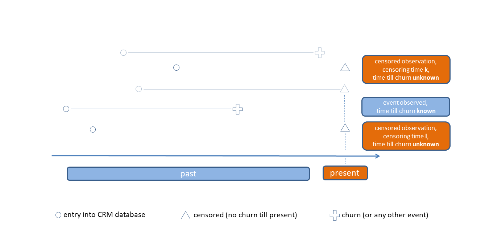
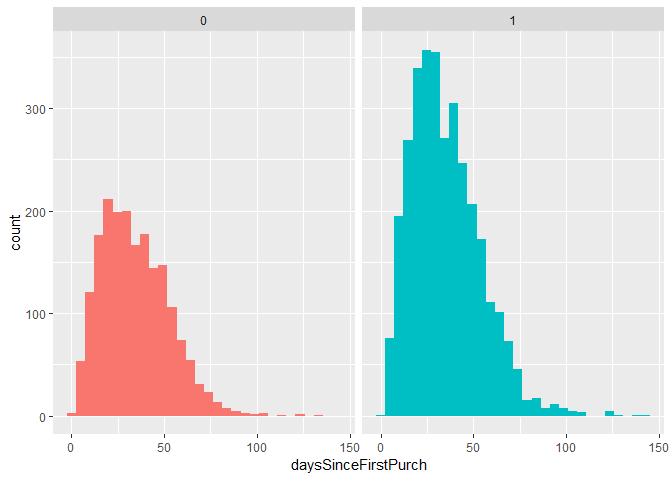
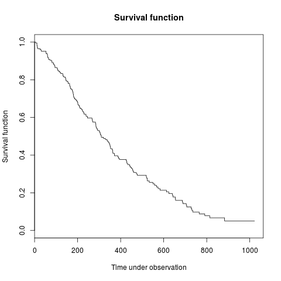
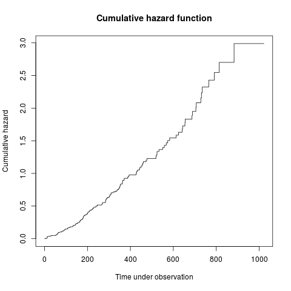
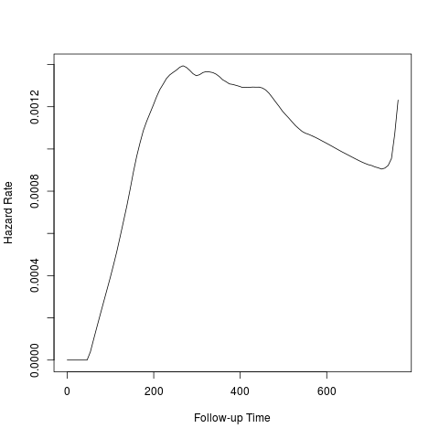
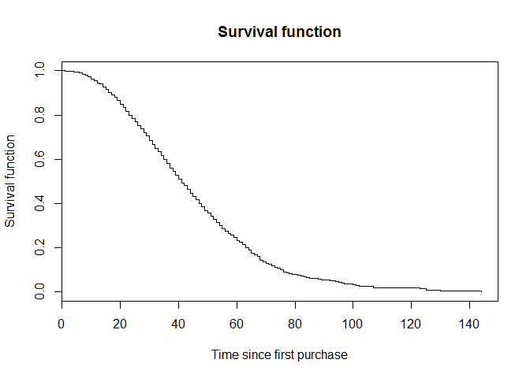
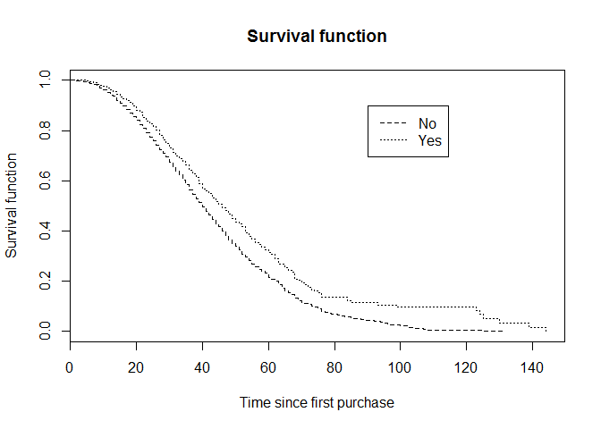
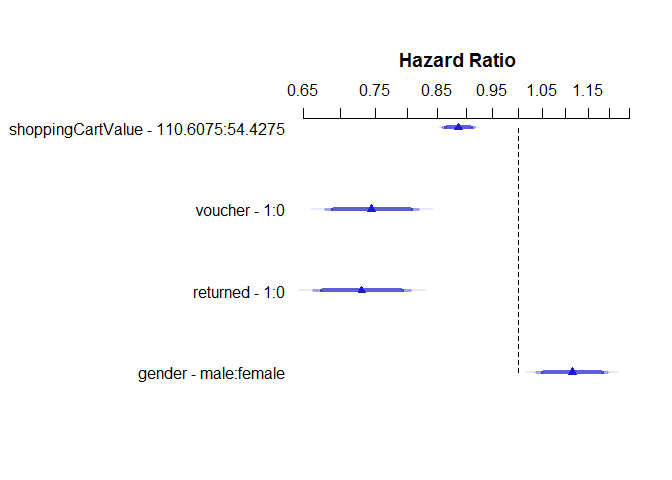

<https://www.datacamp.com/courses/marketing-analytics-in-r-statistical-modeling>

marketing analytics

Modeling Time to Reorder with Survival Analysis

> This could be the time until next order or until a person churns.
> 
> After ordering for the first time in an online shop, when do customers
> place their second order?

下次登录的时间，可以看这样的一个变化趋势。 如果没有的话，那么就是还没有表现，用`now()` 就使用立即申请的来看。

-----

censored data 对于 logistic regression 就是缺失值，因此使用生存分析。

帮助在流失前，进行营销的时间点。

``` r

```

<!-- -->

churn 英 \[tʃəːn\]美 \[tʃərn\] 注意读音

``` r
library(data.table)
dataNextOrder <- fread("data/survivalDataExercise.csv")
```

``` r
library(tidyverse)
```

    ## -- Attaching packages --------------------------------------------------------------------------------- tidyverse 1.2.1 --

    ## √ ggplot2 3.1.0     √ purrr   0.2.5
    ## √ tibble  1.4.2     √ dplyr   0.7.8
    ## √ tidyr   0.8.2     √ stringr 1.3.1
    ## √ readr   1.2.1     √ forcats 0.3.0

    ## -- Conflicts ------------------------------------------------------------------------------------ tidyverse_conflicts() --
    ## x dplyr::between()   masks data.table::between()
    ## x dplyr::filter()    masks stats::filter()
    ## x dplyr::first()     masks data.table::first()
    ## x dplyr::lag()       masks stats::lag()
    ## x dplyr::last()      masks data.table::last()
    ## x purrr::transpose() masks data.table::transpose()

``` r
# Look at the head of the data
head(dataNextOrder)
```

    ##    daysSinceFirstPurch shoppingCartValue gender voucher returned
    ## 1:                  37             33.44   male       0        0
    ## 2:                  63             31.71   male       1        0
    ## 3:                  48             27.31 female       0        0
    ## 4:                  17             41.07   male       0        0
    ## 5:                  53             65.56 female       0        0
    ## 6:                  11             38.44 female       0        0
    ##    boughtAgain
    ## 1:           0
    ## 2:           1
    ## 3:           0
    ## 4:           1
    ## 5:           0
    ## 6:           1

``` r
# Plot a histogram
ggplot(dataNextOrder) +
  geom_histogram(aes(x = daysSinceFirstPurch,
                     fill = factor(boughtAgain))) +
  facet_grid( ~ boughtAgain) + # Separate plots for boughtAgain = 1 vs. 0
  theme(legend.position = "none") # Don't show legend
```

    ## `stat_bin()` using `bins = 30`. Pick better value with `binwidth`.

<!-- -->

> there are more customers in the data who bought a second time. Apart
> from that, the differences between the distributions are not very
> large.

这里的结果还没有接近生存分析。

``` r

```

<!-- -->

``` r

```

<!-- -->

``` r

```

<!-- -->

两图成反比，累计风险率随着时间增加而增加。

> Very good, you identified the wrong statement\! The hazard rate can go
> up and down. For example, customers could be very likely to churn at
> the beginning of their customer relationship, then become less likely
> for some months, and then become more likely again due to a saturation
> effect.

风险率一开始很低，之后变高，之后又可以变低，不一定是单调的。

> Survival analysis is suited for situations where for some observations
> an event has not yet happened, but may happen at some point in time.

``` r
cbind(dataSurv %>% select(tenure, churn),
      surv = Surv(dataSurv$tenure, dataSurv$churn)) %>% head(10)
```

这种生存模型的数据合并方法值得借鉴。

``` r
> print(fitKM)
Call: survfit(formula = Surv(dataSurv$tenure, dataSurv$churn) ~ 1, 
    type = "kaplan-meier")

      n  events  median 0.95LCL 0.95UCL 
   5311    1869      70      68      72
```

多少样本，events发生的sum，50%的quantile需要多少时间，对应的置信区间

``` r
> print(fitKMstr)
Call: survfit(formula = Surv(tenure, churn) ~ Partner, data = dataSurv)

               n events median 0.95LCL 0.95UCL
Partner=No  2828   1200     45      41      50
Partner=Yes 2483    669     NA      NA      NA
```

`NA`的情况是有同事的人，最后都没有离职。

``` r
library(survival)
# Create survival object
survObj <- Surv(dataNextOrder$daysSinceFirstPurch
                ,dataNextOrder$boughtAgain)

# Look at structure
str(survObj)
```

    ##  'Surv' num [1:5122, 1:2]  37+  63   48+  17   53+  11   22   16   74+  44  ...
    ##  - attr(*, "dimnames")=List of 2
    ##   ..$ : NULL
    ##   ..$ : chr [1:2] "time" "status"
    ##  - attr(*, "type")= chr "right"

``` r
# Compute and print fit
fitKMSimple <- survfit(survObj ~ 1)
print(fitKMSimple)
```

    ## Call: survfit(formula = survObj ~ 1)
    ## 
    ##       n  events  median 0.95LCL 0.95UCL 
    ##    5122    3199      41      40      42

``` r
# Plot fit
plot(fitKMSimple,
     conf.int = FALSE, xlab = "Time since first purchase", ylab = "Survival function", main = "Survival function")
```

<!-- -->

``` r
# Compute fit with categorical covariate
fitKMCov <- survfit(survObj ~ voucher, data = dataNextOrder)

# Plot fit with covariate and add labels
plot(fitKMCov, lty = 2:3,
     xlab = "Time since first purchase", ylab = "Survival function", main = "Survival function")
legend(90, .9, c("No", "Yes"), lty = 2:3)
```

<!-- -->

> Customers using a voucher seem to take longer to place their second
> order. They are maybe waiting for another vouche.

用 voucher 的产生下次order的时间比较长。

# Cox PH model with constant covariates

\[\lambda(t|x) = \lambda(t) \dot \exp(x'\beta)\]

\(\beta\)根据模型，在时间是恒定的。

``` r
library(rms)
```

    ## Loading required package: Hmisc

    ## Loading required package: lattice

    ## Loading required package: Formula

    ## 
    ## Attaching package: 'Hmisc'

    ## The following objects are masked from 'package:dplyr':
    ## 
    ##     src, summarize

    ## The following objects are masked from 'package:base':
    ## 
    ##     format.pval, units

    ## Loading required package: SparseM

    ## 
    ## Attaching package: 'SparseM'

    ## The following object is masked from 'package:base':
    ## 
    ##     backsolve

``` r
# Determine distributions of predictor variables
dd <- datadist(dataNextOrder)
options(datadist = "dd")

# Compute Cox PH Model and print results
fitCPH <- cph(Surv(daysSinceFirstPurch, boughtAgain) ~ shoppingCartValue + voucher + returned + gender,
              data = dataNextOrder,
              x = TRUE, y = TRUE, surv = TRUE)
print(fitCPH)
```

    ## Cox Proportional Hazards Model
    ##  
    ##  cph(formula = Surv(daysSinceFirstPurch, boughtAgain) ~ shoppingCartValue + 
    ##      voucher + returned + gender, data = dataNextOrder, x = TRUE, 
    ##      y = TRUE, surv = TRUE)
    ##  
    ##                       Model Tests       Discrimination    
    ##                                            Indexes        
    ##  Obs       5122    LR chi2    155.68    R2       0.030    
    ##  Events    3199    d.f.            4    Dxy      0.116    
    ##  Center -0.2808    Pr(> chi2) 0.0000    g        0.238    
    ##                    Score chi2 140.57    gr       1.269    
    ##                    Pr(> chi2) 0.0000                      
    ##  
    ##                    Coef    S.E.   Wald Z Pr(>|Z|)
    ##  shoppingCartValue -0.0021 0.0003 -7.56  <0.0001 
    ##  voucher           -0.2945 0.0480 -6.14  <0.0001 
    ##  returned          -0.3145 0.0495 -6.36  <0.0001 
    ##  gender=male        0.1080 0.0363  2.97  0.0029  
    ## 

``` r
# Interpret coefficients
exp(fitCPH$coefficients)
```

    ## shoppingCartValue           voucher          returned       gender=male 
    ##         0.9978601         0.7449362         0.7301667         1.1140891

``` r
# Plot results
plot(summary(fitCPH), log = TRUE)
```

<!-- -->

1.  可以看\(R2\)

> shopping cart value increase of 1 dollar decreases the hazard to buy
> again by a factor of only slightly below 1 - but the coefficient is
> significant, as are all coefficients.

因此只能看定性分析，不能看定量的。

> For customers who used a voucher, the hazard is 0.74 times lower, and
> for customers who returned any of the items, the hazard is 0.73 times
> lower.

但是分类变量，可以看占比了。

> Being a man compared to a women increases the hazard of buying again
> by the factor
1.11.

这里的占比都是复购率的对比。

<input type="checkbox" id="checkbox1" class="styled">感觉检验方面还是有困难

<https://campus.datacamp.com/courses/marketing-analytics-in-r-statistical-modeling/modeling-time-to-reorder-with-survival-analysis?ex=13>
书签
